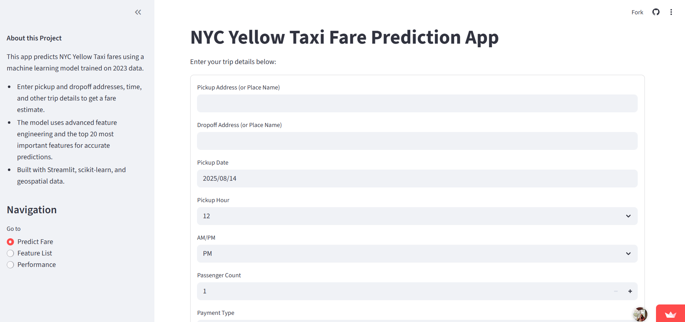
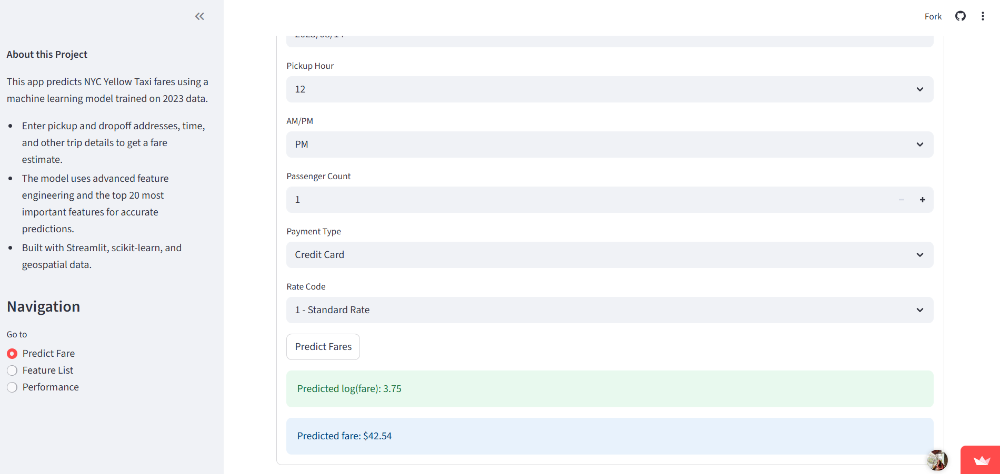
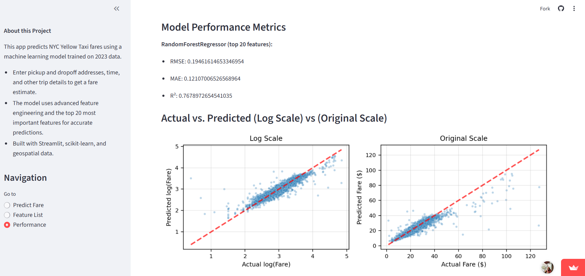
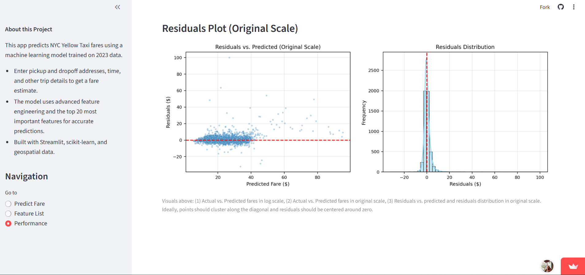
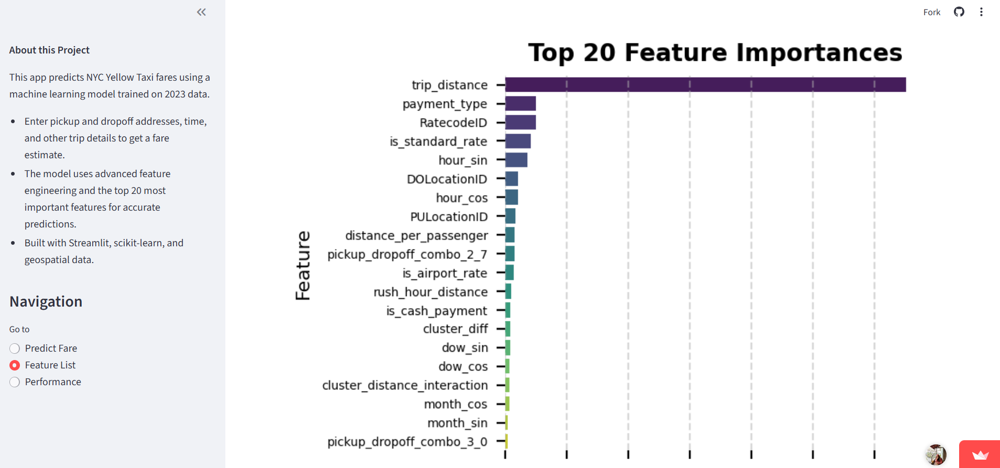

# NYC Yellow Taxi ML Modeling (Jan-Aug 2023)

This project builds a robust machine learning pipeline and interactive app to predict NYC Yellow Taxi fares using 2023 trip data. The pipeline leverages advanced feature engineering, clustering, and a RandomForestRegressor model, with a user-friendly Streamlit app for fare prediction and model interpretability.

**Live app:** [https://chawthinn-nyc-yellow-taxi-ml-modeling-jan-aug-2023-app-cywfhi.streamlit.app/](https://chawthinn-nyc-yellow-taxi-ml-modeling-jan-aug-2023-app-cywfhi.streamlit.app/)

---

## Features

- **Streamlit App**: Predict fares, visualize feature importances, and explore model performance.
- **Top 20 Features**: Model uses the most important features for accurate, interpretable predictions.
- **Geospatial Intelligence**: Uses NYC taxi zones, clustering, and geocoding for spatial features.
- **Performance Visuals**: Actual vs. predicted plots, residuals, and metrics for transparency.
- **.env Support**: Securely manage API keys and secrets.

---

## Quickstart

### 1. Clone the repository

```bash
git clone https://github.com/chawthinn/nyc-yellow-taxi-ml-modeling-jan-aug-2023.git
cd nyc-yellow-taxi-ml-modeling-jan-aug-2023
```

### 2. Install dependencies

```bash
pip install -r requirements.txt
```

### 3. Set up your `.env` file

Copy `.env.example` to `.env` and fill in your Google Maps API key:

```bash
cp .env.example .env
```
Edit `.env` and set:
```
GOOGLE_API_KEY=your_actual_key_here
```

### 4. Run the Streamlit app

```bash
streamlit run app.py
```

---

## File Structure

- `app.py` — Main Streamlit app for fare prediction and model insights.
- `datasets/` — CSVs for zone lookup, average trip distance, and test samples.
- `trained_models/` — Pretrained model, feature columns, and clustering centers.
- `requirements.txt` — All required Python packages.
- `.env.example` — Example environment file; copy to `.env` and fill in your own values.
- `.env` — Your API keys (not tracked by git).

---

## Requirements

See `requirements.txt` for all dependencies. Key packages:
- streamlit
- pandas
- numpy
- geopandas
- shapely
- joblib
- matplotlib
- seaborn
- scikit-learn
- python-dotenv
- requests

---

## Usage

1. Enter pickup/dropoff addresses and trip details in the app.
2. The app geocodes addresses, maps to taxi zones, and computes engineered features.
3. The trained model predicts the fare and displays results.
4. Explore feature importances and model performance on dedicated pages.

---

## Screenshots

<p align="center">
  
  
  
  
  
</p>

---

## Notes

- The app does **not** require Spark to run; all prediction and feature engineering is done with pandas and scikit-learn.
- For best results, use a valid Google Maps API key in your `.env`.

---

## License

MIT License
